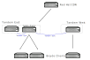

# Bicycle Server and Bicycle Client Roles

The aim of these roles is to get you up and running with Bicycle as quickly as possible. With that we will start our journey (or bike ride) with a simple goal. A single server and a single client

## Starting Small

The bicycle server is a simple service to set to set up and maintain, indeed that is one of the primary goals of bicycle - simplicity and stability.

### Getting Started

Before we start we require 3 servers to be setup, just a default base OS install and one of them (the one that will be the server) should be registered to Red Hat via subscription manager. You should attach a subscription and make sure you are able to install software via Red Hat. Do a yum list http for example and see if that works. If so then lets carry on

the other 2 will be the clients, they don't **need** to be registered to Red Hat - unless you want to take advantage of the Red Hat Insights etc. If you do subscribe them, be sure to disable all repos with 

 subscription-manager repos --disable="*"

Much (if not all) of the automation is ansible based, so we should setup our hosts file. There is one provided in the git repo - *manage/bicycle-inventory* but this is to complex to get started with. So lets start with an inventory that looks like this

----
[bicycle_servers]
bicycle1.lab.home.adrians.computer ansible_user=root

[bicycle_clients]
bicycle-client1.lab.home.adrians.computer ansible_user=root bicycle_server=bicycle1.lab.home.adrians.computer repos='["rhel-7-server-rpms", "rhel-7-server-extras-rpms"]'
bicycle-client2.lab.home.adrians.computer ansible_user=root bicycle_server=bicycle1.lab.home.adrians.computer repos='["rhel-7-server-rpms", "rhel-7-server-extras-rpms"]'

----

As you can see there are two groups (the entries inside []) and the first group has one member and the 2nd group as two - directly below the group names. 

Next make sure your ssh key is copied to the three servers root account. You could use this to do so

 ssh-copy-id root@bicycle1.lab.home.adrians.computer 
 ssh-copy-id root@bicycle-client1.lab.home.adrians.computer
 ssh-copy-id root@bicycle-client2.lab.home.adrians.computer

Once you have done this, ansible should be able to connect without any problems 

 ansible all [-i your_inventory] -m ping

You should get back a *pong* from both servers, if you do then continue, otherwise fix your login issues first

The bicycle-server role assumes you have a 2nd disk available for holding all your RPMs that are pulled down from Red Hat. We assume this disk is */dev/sdb* - if it is not, then you should edit the playbook that calls the role - example-roles/bicycle-servers-setup.yml and enter the correct designator and sizing details

.example-roles/bicycle-servers-setup.yml
----
 ./bicycle-servers-setup.yml
- hosts: bicycle-servers
  vars:
    vdo_disk: sdb
    vdo_disk_name: vdo1
    vdo_logical_size: 200G
    repo_directory: /var/www/html/repos
  become: true

  roles:
     - bicycle-server
----

Ok once this is done, you are ready to run the playbook to set up the server

 ansible-playbook [-i your_inventory] example-roles/./bicycle-servers-setup.yml

### Sync some repositories

OK, the server is now setup but has no data synchronised from Red Hat so far. Enter the next playbook called reposync.yml   Simply run this playbook and pass in an extra variable to tell it which repo you would like to sync

 ansible-playbook manage/reposync.yml --extra-vars "repo=rhel-7-server-rpms"

After some time this should complete the process and you will have a local copy of the repo sitting in the root of your web server. A '.repo' file will have been created for you to use with your client, but we will get to that later

Some suggested additional repos

 ansible-playbook manage/reposync.yml --extra-vars "repo=rhel-7-server-extras-rpms"
 ansible-playbook manage/reposync.yml --extra-vars "repo=rhel-7-server-rh-common-rpms"

OK, so the server is set up and serving three repositories, now let's get the client configured

### Setup the clients

If you remember from earlier, when we setup the hosts file, we defined a couple of clients, and a few additional variables 

----
...
[bicycle_clients]
bicycle-client1.lab.home.adrians.computer ansible_user=root bicycle_server=bicycle1.lab.home.adrians.computer repos='["rhel-7-server-rpms", "rhel-7-server-extras-rpms"]'
bicycle-client2.lab.home.adrians.computer ansible_user=root bicycle_server=bicycle1.lab.home.adrians.computer repos='["rhel-7-server-rpms", "rhel-7-server-extras-rpms"]'
----

As you can see, we are defining which bicycle server it should be configured for and an array of repos to enable. So lets configure the client

 ansible-playbook [-i your_inventory] example-roles/bicycle-clients-setup.yml 

And that's it, you can now log into your clients and do a **yum list all** and you will see that they are working as expected, pulling their RPMs from the bicycle server

Adding additional clients is simply a matter of adding extra lines to the hosts file and re-running the playbook

## Scale up

So let's make this scale up, 1 server and 2 clients is un-realistic, in reality you will have hundreds, if not thousands of hosts. In order to reduce outages or the need for downtime, we will make the bicycle server Highly Available. We will add two more servers next to the main bicycle server, each of these will have its content kept in sync, so that any one of the three servers will be able to fulfil requests. We will also add one more client later on.

In order to configure the clients for this we can make use of a **mirror-list**- Dont worry, it's a simple as setting **mirror-list true** in your ansible hosts file and ansible will configure your clients with a local mirror-list that contains all the servers that are in the clients **tandem-group**. If the first server is down (un-expectedly) then the client will fail over to the next one. In fact, so long as one of the servers in the group is online, the clients will still have access to packages

Lets take a look at how the ansible playbook would look like for this

----
[bicycle_servers]
bicycle1.lab.home.adrians.computer ansible_host=10.10.10.121 ansible_user=root
bicycle2.lab.home.adrians.computer ansible_host=10.10.10.122 ansible_user=root
bicycle3.lab.home.adrians.computer ansible_host=10.10.10.123 ansible_user=root

[tandem_east]
bicycle1.lab.home.adrians.computer ansible_host=10.10.10.121 ansible_user=root tandem_master=""
bicycle2.lab.home.adrians.computer ansible_host=10.10.10.122 ansible_user=root tandem_master=bicycle1.lab.home.adrians.computer
bicycle3.lab.home.adrians.computer ansible_host=10.10.10.123 ansible_user=root tandem_master=bicycle1.lab.home.adrians.computer

[bicycle_clients:vars]
repos='["rhel-7-server-rpms", "rhel-7-server-extras-rpms", "rhel-7-server-rh-common-rpms"]'
tandem_group=tandem_east 
mirror_list=true

[bicycle_clients]
bicycle-client1.lab.home.adrians.computer ansible_user=root bicycle_server=bicycle1.lab.home.adrians.computer 
bicycle-client2.lab.home.adrians.computer ansible_user=root bicycle_server=bicycle2.lab.home.adrians.computer 
----

Ok so we can see some changes to the hosts file

* we have a new group "tandem_east" - which is a collection of bicycle servers
* inside this group we see the three servers have a new variable defined "tandem_master", for the first server its blank (its parent is the Red Hat CDN), for the other two servers, they have their "tandem_master" set to server 1. 
* We have another new group called bicycle_clients:vars - this is simply a way to define variables for a group, without having to add them to each client. We moved the **repos** array into the group, and added 2 new vars - **tandem_group** and **mirror_list**. These two settings allow the bicycle-client playbook to configure the clients to the correct tandem group and enable the mirror list option.

=== Setup the server group

OK, before we go any further, we should sync the servers in the tandem group - but lets apply the settings to the servers first

Run the bicycle-server setup 

 ansible-playbook [-i your_inventory] example-roles/bicycle-servers-setup.yml 

This will have configured the three servers with the new settings as defined in the ansible hosts file, but we also need to make sure they have their content synchronise

=== Sync the server group

A new playbook is provided for this **tandem-sync.yml** it will make sure the all the servers in the tandem-group will synchronise with the tandem-master. If you wanted to, you could register all servers with Red Hat and have them all independently pull down their content but this would be inefficient

Lets tun the **tandem-sync** playbook and get the two new servers synchronised

 ansible-playbook [-i your_inventory] manage/tandem-sync.yml 
 
This playbook will cause the serves that have **tandem-master** set, to syncronise the content from this **tandem-master**

=== Setup the Clients

Now the servers are syncronised, we should configure the clients with a mirror-list that details all three servers, the clients will all try the first entry in the list and if it is not available they will failover to the 2nd etc etc

Run the client setup script

 ansible-playbook [-i your_inventory] example-roles/bicycle-clients-setup.yml
 
Once this is completed the clients repo files now point to a mirror-list, held locally on each client. This mirror-list was generated automatically by ansible

## Scale out

OK, so finally lets look at distributing our bicycle servers/tandem-groups geo-graphically

In this scenario, we will split one of the servers out of the tandem-east group and place in a new group called tandem-west. We will also use a (new) third client and configure it to use this new **tandem-group** - even if it is sinlge server group right now :-)

There are a couple of ways this new **tandem-manster** could get its content - we could register the server directly with Red Hat and sync the content from there, as in the diagram below

Or we could have the server in the new group syncronise its content from the **tandem-master** in the tandem_east group - as illustrated below

We will go with the later example - pull the content from an internal server. Lets take a look at how we would alter our ansible hosts file for this

----
[bicycle_servers]
bicycle1.lab.home.adrians.computer ansible_host=10.10.10.121 ansible_user=root
bicycle2.lab.home.adrians.computer ansible_host=10.10.10.122 ansible_user=root
bicycle3.lab.home.adrians.computer ansible_host=10.10.10.123 ansible_user=root

[tandem_east]
bicycle1.lab.home.adrians.computer ansible_host=10.10.10.121 ansible_user=root tandem_master=""
bicycle2.lab.home.adrians.computer ansible_host=10.10.10.122 ansible_user=root tandem_master=bicycle1.lab.home.adrians.computer

[tandem_west]
bicycle3.lab.home.adrians.computer ansible_host=10.10.10.123 ansible_user=root tandem_master=bicycle1.lab.home.adrians.computer

[bicycle_clients:children]
bicycle_clients_east
bicycle_clients_west

[bicycle_clients:vars]
repos='["rhel-7-server-rpms", "rhel-7-server-extras-rpms", "rhel-7-server-rh-common-rpms"]'
tandem_group=tandem_east 
mirror_list=true

[bicycle_clients_east]
bicycle-client1.lab.home.adrians.computer ansible_user=root bicycle_server=bicycle1.lab.home.adrians.computer 
bicycle-client2.lab.home.adrians.computer ansible_user=root bicycle_server=bicycle2.lab.home.adrians.computer 

[bicycle_clients_west:vars]
repos='["rhel-7-server-rpms-2018-09-26", "rhel-7-server-extras-rpms-2018-09-26", "rhel-7-server-rh-common-rpms-2018-09-26"]'
tandem_group=tandem_west 
mirror_list=false

[bicycle_clients_west]
#bicycle-client3.lab.home.adrians.computer ansible_user=root bicycle_server=bicycle3.lab.home.adrians.computer 
bicycle-client3.lab.home.adrians.computer ansible_user=root bicycle_server=bicycle3.lab.home.adrians.computer 
----

Lets go through this line by line.

Firstly we have a group called bicycle_servers - simply a collection of all the servers

Next we have two groups - one of which is new - **tandem_west** - which currently only has one server but could easily have additional servers added when required

The next part **[bicycle_clients:children]** specifies that the group **[bicycle_clients]** has two members - and these members are actually two groups [bicycle_clients_east] and [bicycle_clients_west]. So we have split the clients into two groups and turned the original group into a "group of groups"

Next we have some variables defined at group level - [bicycle_clients:vars] applies to all bicycle clients unless overriden further down at a child group level or at the host level.  The second one **bicycle_clients_west:vars]** is overiding some settings for members of the bicycle_west group

The groups of groups thing can be a little confusing at first, but you will get used to it.

OK, so lets (re)configure our servers and clients. First we should re-configure our servers

  ansible-playbook [-i your_inventory] example-roles/bicycle-servers-setup.yml
  
Next we should ensure that each of the servers has the same content, by performing a **tandem-sync**

  ansible-playbook [-i your_inventory] manage/tandem-sync.yml 
  
Finally lets configure our three clients

  ansible-playbook [-i your_inventory] example-roles/bicycle-clients-setup.yml
  
And thats it, the new configuration is in place, the first two clients are configured with a mirror list, the third client is not as there is currently only a single server on its tandem-group. 

I hope this has given you an idea of how easily the bicycle server architecture scales and the simplicity in its design
